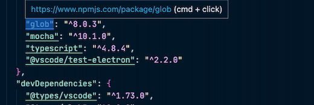

# DepLink

Deplink creates HTTP links for many package managers to access the package pages directly.

## Supported Package Managers
- NPM 
- Python Package Index (PyPI)
- pub.dev
- Composer
- Cargo
# For more information
* [vscode-deplink (Repository)](https://github.com/matsevers/vscode-deplink)
* [Mats Evers (Developer)](https://matsevers.de)

